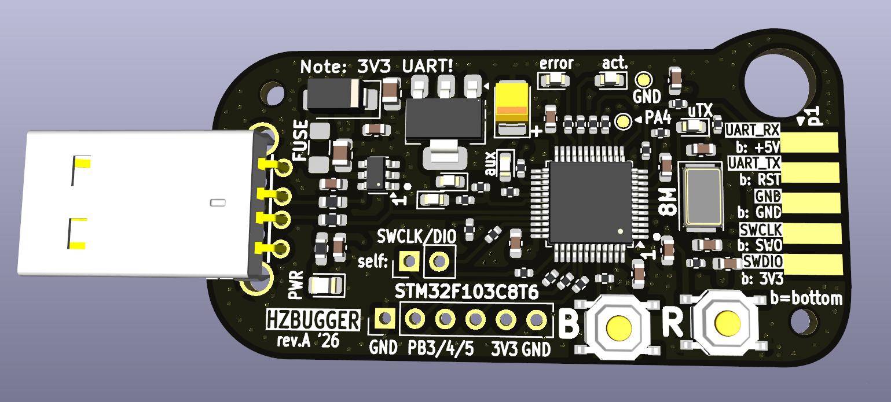
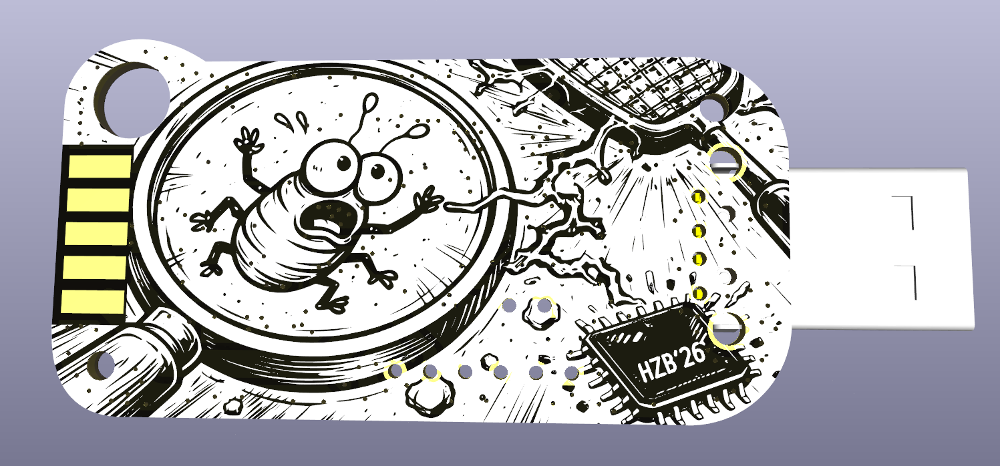

# hzbugger

Hzbugger is an STM32F103C8T6-based Black Magic Probe compatible SWD debugger with UART passthrough. PCB layout by Lasse OH3HZB. Bottom side silkscreen created using AI tools (intended for *black PCB* as in pictures below). 

Basic functionality works out-of-box with BMP bluepill image. Extra LEDs and AUX header requires fw customization.
See [BlackMagic Probe adaptation guide](./blackmagic-probe-adaptation-guide.md) for firmware-porting and usage details.

 

## References

* Website of the BlackMagic Probe: https://black-magic.org/
* BMP firmware repository: https://codeberg.org/blackmagic-debug/blackmagic

## LICENSE

TBD

