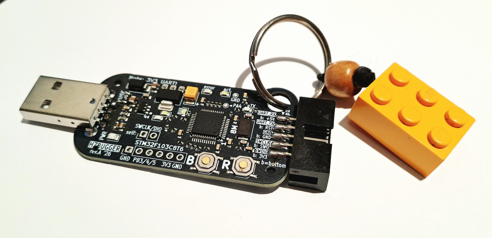

# hzbugger

Hzbugger is an STM32F103C8T6-based Black Magic Probe compatible debugger by Lasse OH3HZB. 

Bottom side silkscreen created using AI tools (intended for *black PCB* as in pictures below). 

Basic functionality works out-of-box with BMP bluepill image. Extra LEDs and AUX header requires fw customization.
See [BlackMagic Probe adaptation guide](./blackmagic-probe-adaptation-guide.md) for firmware-porting and usage details.

 

## Schematic

<a href="./hzbugger-revA-schematic.pdf">hzbugger-revA-schematic.pdf</a>

## Getting started: Using Hzbugger to flash firmware

### Connect the probe

The device should enumerate as /dev/ttyACM0 and /dev/ttyACM1 (on Linux).

### Build the firmware

Build the application so that the output includes an ELF file containing debug information.
For example:

    build/my_application.elf

The ELF file is used both for programming the target and for debugging.
Start GDB from the shell:

    arm-none-eabi-gdb build/my_application.elf

Then run the following commands inside GDB:

    target extended-remote /dev/ttyACM1
    monitor erase_mass
    load
    monitor reset

## Getting started: Using Hzbugger as debugger with Visual Studio Code (vscode)

### Required software

- Visual Studio Code
- ARM GNU Toolchain
- `arm-none-eabi-gdb`
- The Cortex-Debug VS Code extension

The firmware should be built with debug information enabled, for example:

    -g

For development builds, it is also useful to disable compiler optimization:

    -O0

This makes source-level debugging easier.

### Create the VS Code configuration

Create the following file in your project:

    .vscode/launch.json

Add debug configuration:

    {
        "version": "0.2.0",
        "configurations": [
            {
                "name": "Debug with Black Magic Probe",
                "type": "cortex-debug",
                "request": "launch",
                "servertype": "bmp",
                "executable": "${workspaceFolder}/build/my_application.elf",
                "device": "YOUR_MCU",
                "cwd": "${workspaceFolder}",
                "runToEntryPoint": "main"
            }
        ]
    }

Replace `YOUR_MCU` with the name of your target MCU.

Also update the `executable` path if your ELF file is located somewhere else.

### Start debugging

Connect Hzbugger and start the debugger in VS Code using `F5` button.
VS Code will use GDB to connect to the Hzbugger and start a debug session.
You can then use the normal VS Code debugging features:

- Set breakpoints
- Step over — `F10`
- Step into — `F11`
- Step out — `Shift+F11`
- Continue — `F5`
- Inspect variables
- Inspect the call stack
- Use the Watch window
- Inspect registers and memory

---

### Useful Commands

* Check the ARM GDB installation: `arm-none-eabi-gdb --version`
* Find the Hzbugger device: `ls /dev/ttyACM`
* Start GDB manually: `arm-none-eabi-gdb build/my_application.elf`
* Connect to the probe: `target extended-remote /dev/ttyACM1`
* Erase flash: `monitor erase_mass`
* Flash the firmware: `load`
* Reset the target: `monitor reset`

(Hzbugger acts as a GDB server itself so you do not need to start a separate (e.g. OpenOCD) GDB server)

## References

* Website of the Black Magic Probe: https://black-magic.org/
* BMP firmware repository: https://codeberg.org/blackmagic-debug/blackmagic

## LICENSE

CERN-OHL-S (strongly reciprocal), see [LICENSE.txt](./LICENSE.txt) for details.
